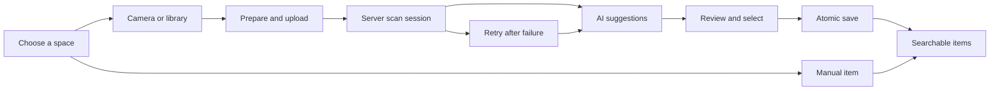

# Home Catalogue review

Review date: 11 September 2026. Baseline: `dde856b82a2335ebe9e0fd31b24120841c38b506` on `main`.

The priority is quick phone photos, followed by review and save. The user confirmed this priority during the review.

The existing stack suits a personal catalogue. The main problems were flow complexity, fragile scan state, partial saves, and slow optional AI work. A framework rewrite would not solve those problems. This change keeps React 18, Vite 5, Tailwind 3, FastAPI, SQLAlchemy, and SQLite.

## Findings and changes

| Priority | Finding in the previous code | Change |
| --- | --- | --- |
| High | Review created containers and items in separate requests. A partial failure could leave records or duplicate them on retry. | `/api/scan/{id}/accept` saves the whole review in one transaction. A stored receipt makes repeated saves return the same result. |
| High | A lost upload response could create another scan when the user retried. | Each photo keeps one upload request ID. The server returns the existing scan on replay. Concurrent attempts keep separate photo files until one insert succeeds. |
| High | Pending scans stayed stuck after a server restart. The browser alone tracked which scans needed review. | Startup marks interrupted scans for retry. `/api/scan/active?room_id=…` restores unsaved work from the server. Photos remain available. |
| High | A connection error appeared as an AI failure. Review edits disappeared after refresh. | The queue retries status checks with increasing delays. Validated review drafts preserve edits and selections in browser storage. |
| High | Room navigation could lose upload progress or failed files. | A shared queue keeps uploads and retry files across routes. A browser warning protects photos that have not uploaded yet. |
| High | Moved scans and old review drafts could use obsolete destinations or AI results. | The queue follows the server's room. Drafts require a matching result revision. Acceptance checks the room, revision, and current destinations. |
| High | Uploads accepted arbitrary bytes and original filenames. | The server validates image content, caps size and dimensions, creates filenames, applies orientation, and removes original metadata. |
| High | Synchronous cloud SDK calls blocked the async server loop. | Cloud providers use async clients. Image preparation runs outside the event loop. |
| High | Manual saves and edits waited for optional text embeddings. | Saves enqueue indexing after commit. Indexing releases database sessions during inference and rejects stale results after an edit. |
| High | Container edits allowed parent cycles. Item writes could refer to containers or scans in another room. | The API validates locations, relationships, batch writes, and parent chains before changes. |
| High | Same-name containers could silently select the wrong location. | Automatic matching requires an unambiguous name within the relevant parent. Explicit IDs remain authoritative. |
| High | Delayed property responses could show one name while a delete action targeted another property. | Route-specific state and request sequence checks prevent stale responses from replacing the current page. |
| Medium | Setup required separate property and room screens before capture. | One form creates the first property and space. The catalogue opens rooms directly and remembers the last room. |
| Medium | Camera capture and library import shared an unclear control. Upload preparation was invisible. | Separate camera and library actions support repeated photos and multiple-file selection. The queue shows preparation, upload, analysis, and review states. |
| Medium | The standalone review route did not save. | It now opens the working room review flow. |
| Medium | Removing a result was destructive during review. Optional fields made every result expensive to check. | Selection is reversible. Details stay optional. The source photo is available inside a native review dialog. |
| Medium | A photo that contained only containers had no usable save path. | Users can select, name, place, and save proposed containers without adding an item. |
| Medium | Keyword search waited for semantic inference. Results did not show nested locations. | Keyword search is the default. Related AI matches are optional. Results show full locations and open the selected item. |
| Medium | Container expansion never changed state. Child creation did not refresh the tree. | Expansion works with keyboard and touch controls. Selected descendants reveal their parents. Child creation refreshes the tree and reports errors. |
| Medium | Item actions relied on hover, small icons, or repeated confirmations. | Visible controls, larger targets, native dialogs, save guards, and one delete confirmation improve item management. |
| Medium | The app offered no quick path when AI was unavailable. | Rooms support manual item entry with an optional category. |
| Medium | Settings waited for model discovery before rendering. Old model responses could replace a newer provider's list. | Settings render after configuration loads. Request sequence checks reject stale discovery and connection results. |
| Medium | Explicit cloud provider defaults could become Ollama accidentally. | Stored provider choices remain authoritative. Environment provider choices work when no stored choice exists. Settings show the effective provider and model. |
| Medium | AI results could include malformed optional fields or inferred objects. | Parsing validates required structure and normalises optional fields. The prompt asks for visible objects and generic names when details are unclear. |
| Medium | Small phone controls, disabled browser zoom, and weak modal focus reduced accessibility. | The app permits zoom, uses 16px form text on narrow screens, adds mobile navigation, improves contrast, and uses native modal focus handling. |

The browser checks found and fixed two integration defects. Room spacing pushed the review footer below the viewport. The review now renders outside that layout and keeps its actions above the bottom safe area. A retry link could also arrive before room data loaded, leaving the review dialog closed. The dialog now opens when its content is ready. Each new review starts at the top. Container filters show full paths to distinguish repeated names.

## Structure after the change

The frontend keeps one API client. `App.jsx` loads shared property and room navigation data. `HouseList.jsx` provides the catalogue and capture destination picker. `RoomView.jsx` remains the room workspace.

Four modules now isolate the scan flow:

- `useScanQueue.js` connects React to the shared scan store.
- `scanQueueStore.js` owns uploads, polling, retries, and recovery across room navigation.
- `scanStorage.js` validates and stores scan IDs and review drafts.
- `scanReview.js` resolves destinations and builds the acceptance payload without UI dependencies.

The backend keeps resource routers, Pydantic contracts, and service modules. Scan acceptance owns the transaction. The shared embedding helper owns delayed indexing. Existing database tables and item APIs remain in use.

The yellow and charcoal identity remains. The catalogue now emphasises actions and locations. Forms, menus, empty states, and recovery paths use clearer labels. New dependencies were not added.

## Limits and next improvements

These are separate from the implemented capture and save improvements.

1. **Patch and audit dependencies before deployment.** The repository pins `python-multipart==0.0.9`. It falls within the affected range for a documented multipart denial-of-service issue. Image validation occurs after multipart parsing and does not fix that parser issue. Upgrade FastAPI, its compatible Starlette version, and multipart together. Run the complete suite and a dependency audit. Package versions remain unchanged in this pass. [Maintainer advisory](https://github.com/Kludex/python-multipart/security/advisories/GHSA-59g5-xgcq-4qw3).
2. **Add durable offline capture.** Photos that have not uploaded remain in browser memory. Use IndexedDB for a durable local upload queue, explicit sync states, storage limits, and retry controls. A manifest alone does not provide offline operation. [MDN offline guidance](https://developer.mozilla.org/en-US/docs/Web/Progressive_web_apps/Guides/Offline_and_background_operation).
3. **Add authentication for shared or remote access.** The current API has no user authentication. Anyone who can reach it can read and change the catalogue. Add household membership and authorisation before remote exposure. Keep this a separate, tested feature.
4. **Use worker leases for multiple server processes.** Current restart recovery fits the existing single Uvicorn process. A second process must not mark another process's live scans as interrupted. A durable queue with ownership, leases, concurrency limits, and cancellation is the next server architecture step. [FastAPI background-task guidance](https://fastapi.tiangolo.com/tutorial/background-tasks/).
5. **Measure recognition quality with real photos.** Build a small labelled set covering shelves, drawers, glare, small labels, repeated objects, and poor light. Compare missed objects, invented objects, edit count, and time to a saved list. Confidence scores are model estimates. No measured recognition improvement is claimed here.
6. **Add quantity and duplicate decisions explicitly.** Current records represent individual items. A repeated name is a suggestion to check, not proof of a duplicate. A future quantity field needs clear rules for rescan, move, edit, and export. Do not deduplicate automatically by name.
7. **Add backup and restore as a complete feature.** CSV and JSON exports contain records. They do not include photos or provide a full restore flow. A portable archive should include images, records, checksums, and a tested importer.
8. **Scale search after measuring a real catalogue.** Keyword search uses database text filters. Optional semantic search loads stored embeddings for comparison. Add pagination and SQLite FTS when the measured catalogue size justifies them. A vector service is unnecessary for a small personal inventory. Background indexing is best-effort. A service outage or restart can leave items without embeddings. Keyword search remains available, and Reindex catalogue can rebuild embeddings.
9. **Verify deployment.** This change fixes SPA routing, API 404 handling, path containment, and missing upload-directory startup. Automated tests and local runtime checks pass. Docker uses Nginx for the frontend. A local check does not prove deployed behaviour.

Camera behaviour varies by browser and device. Separate camera and library inputs preserve a fallback. Physical phone checks remain necessary. [MDN capture attribute](https://developer.mozilla.org/en-US/docs/Web/HTML/Reference/Attributes/capture).

## Validation record

- The final frontend production build passed: 59 modules, 86.08 kB compressed JavaScript, and 6.38 kB compressed CSS.
- All 35 frontend regression tests passed. They cover photo sizing, review payloads, destination checks, draft revisions, route changes, upload replay IDs, and recovery races.
- Python source compilation passed for backend modules and tests. `git diff --check` passed.
- All 111 backend tests passed in 6.27 seconds with the pinned packages on Python 3.12. They cover atomic rollback, concurrent acceptance, restart recovery, uploads, settings, search, item validation, and delayed indexing.
- Pytest reported 783 warnings. These concern UTC datetime deprecations, a Pydantic protected namespace, and the older Starlette testing API. They remain maintenance work.
- Browser checks passed at desktop sizes of 1280 × 720 and 1280 × 800, and phone sizes of 390 × 844 and 320 × 740. The 320px review had no horizontal overflow. Its dialog stayed within the viewport.
- The backend served the production frontend at `/rooms/1`. JavaScript and CSS returned HTTP 200 with their expected content types. Browser logs contained no application errors.
- Runtime checks returned HTTP 200 for health and a valid SPA route. Unknown API routes, missing assets, and encoded parent-directory paths returned HTTP 404.
- Tests used a temporary SQLite database, synthetic images, and fixed vision responses. A failed scan state was seeded in that temporary database to check the retry UI. No live vision inference, physical phone test, deployment, or production data migration is claimed.
- The mechanical design check found only inherited font choices and the existing decorative grid. It found no new component issues in the checked files.
- Source searches supplied the review evidence while GitNexus registry access was blocked. After local execution became available, `gitnexus analyze --index-only --force` completed successfully. Status matched HEAD. Hash comparisons confirmed that indexing preserved the tracked diff and all untracked files.

Use `npm --prefix frontend test` for the scan utilities. Use `npm --prefix frontend run build` for the frontend. Run `python -m pytest tests -q` from `backend` in an environment with `backend/requirements.txt` installed. Use temporary storage and a temporary SQLite database for runtime checks.

The completed browser checks covered:

| Flow | Observed result |
| --- | --- |
| First-run setup | One form created the property and Kitchen, then opened capture. |
| Manual entry | Items saved both in the room and in a nested drawer. |
| Photo input | Library input accepted two files. Camera input accepted one file and retained the selected container. |
| Room navigation | Both uploaded photos remained available for review after leaving and returning. |
| Draft recovery | An edited item name and an excluded item survived a full page reload. |
| Review save | The selected item and proposed container saved together. The next review opened. |
| Container-only save | A drawer saved under its shelf with no items selected. |
| Retry | The failed photo retained its image and destination. Retry opened a new review and saved successfully. |
| Search | A multiword search found the item, showed `Shelf / Drawer`, and opened the exact item. |
| Item management | Category and notes saved. Moving the item to its shelf left the drawer empty. |
| Nested locations | Expansion revealed child containers. Repeated container names had distinct path labels. |
| Phone navigation | Escape closed the menu and restored focus. Resizing an open menu to desktop restored the main content. |
| Settings | The form remained usable when model discovery could not connect to the local AI server. |
| Final data check | All three test scans were filed. The temporary catalogue contained exactly five items and three containers. |

These checks prove the local workflow with fixture responses. They do not measure recognition accuracy or real-device camera behaviour.
